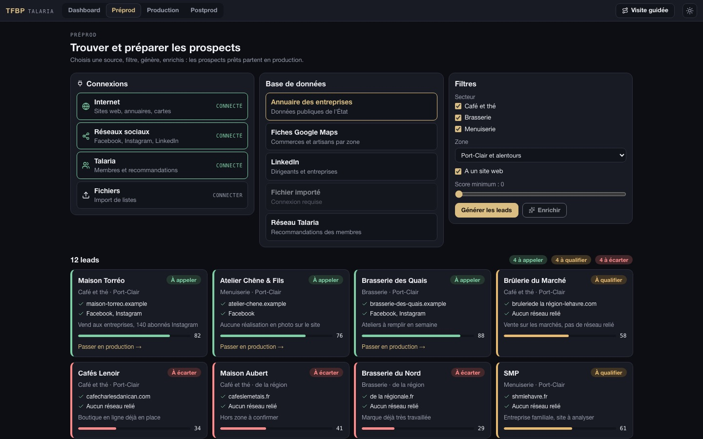
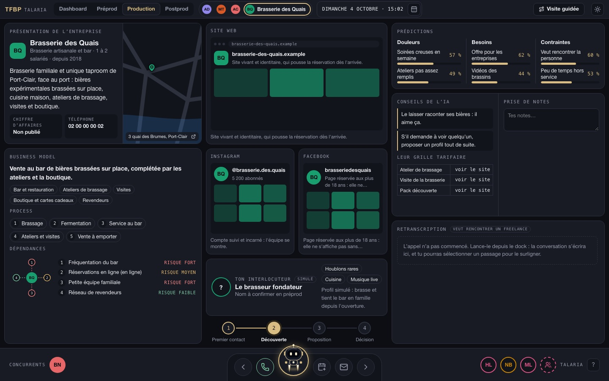
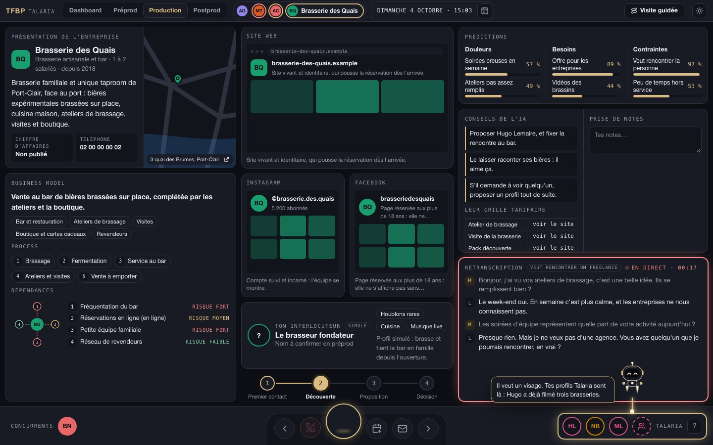
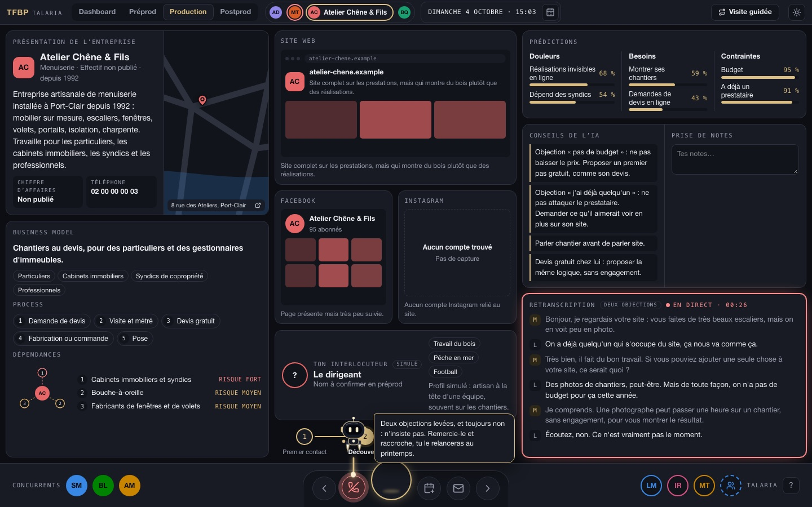
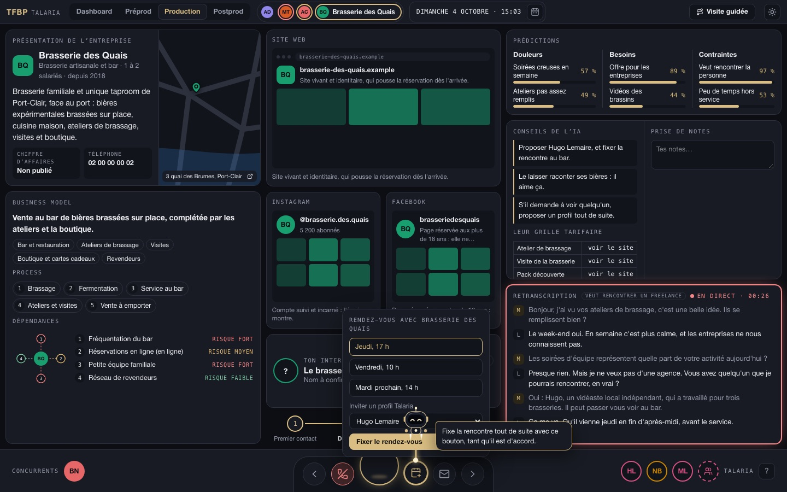
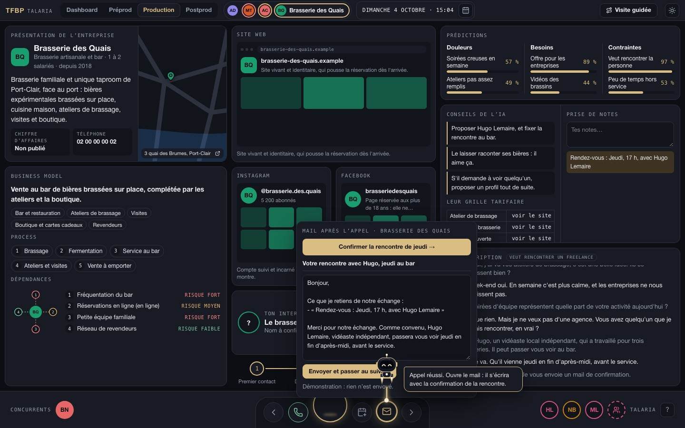
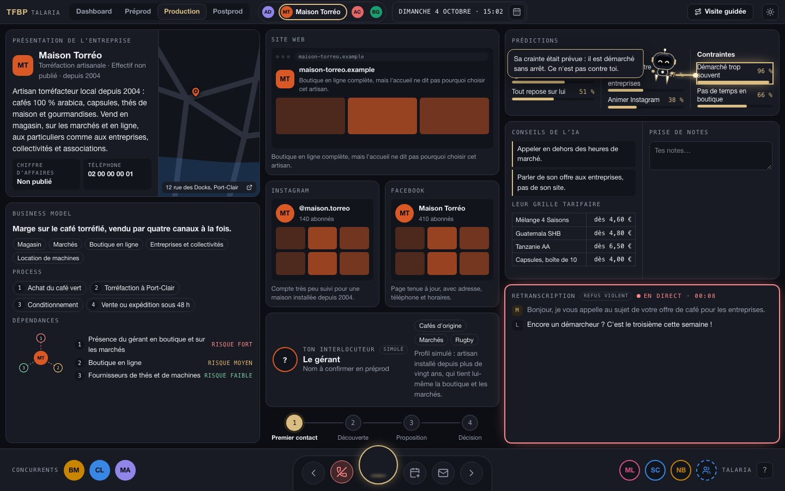
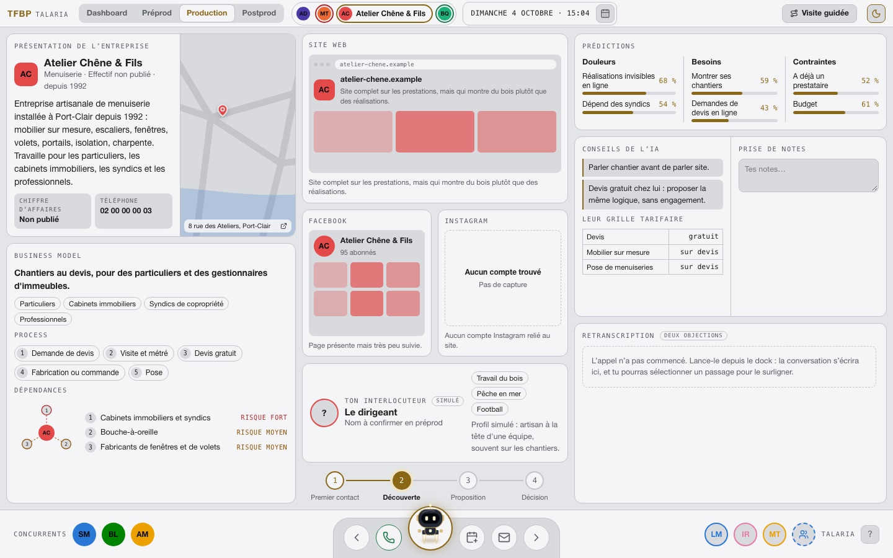
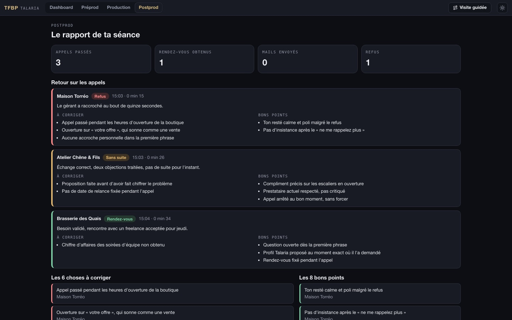
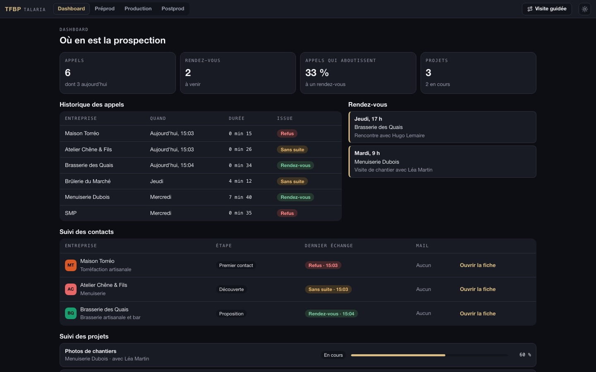

  

<h1 align="center">TFBP · Tools For Best Prospection</h1>

<strong>Le copilote qui décroche avec toi.</strong> Des leads prêts, une fiche qui tient sur un écran, et un robot qui te montre quoi dire pendant l'appel.

Un outil <a href="https://github.com/TalariaIsComming/Talaria-Public">Talaria</a> · Prototype front · <a href="video/presentation.mp4">Voir le film (30 s)</a>

> **Ce dépôt est une vitrine.** Tu y trouves des captures et des vidéos de l'interface. Le code n'est pas publié. Tout ce qui apparaît à l'écran est fictif : entreprises, interlocuteurs, appels, chiffres.

## Pourquoi TFBP

Prospecter, c'est jongler : dix onglets ouverts, une fiche dans un tableur, et personne pour te souffler la bonne phrase quand ça coince. TFBP met tout au même endroit et te laisse faire la seule chose qui compte : parler à quelqu'un.

| Avant | Avec TFBP |
|---|---|
| Tu cherches tes prospects à la main | Les leads se créent, s'enrichissent et se trient par couleur |
| Tu ouvres le site, LinkedIn, Maps, tes notes | Tout est sur un seul écran |
| Tu improvises face à une objection | L'aide s'affiche au moment où elle arrive |
| Tu rédiges ton mail après l'appel | Il s'écrit tout seul, avec ce que tu as surligné |
| Tu ne sais pas ce qui a cloché | La séance se termine par un vrai retour |

## En action

  

<em>Un appel de bout en bout : la conversation s'écrit, Talabot pointe la bonne info, le rendez-vous est pris, le mail se rédige.</em> · <a href="video/demo-appel.mp4">Version vidéo</a>

## Le parcours, en quatre temps

### 1. Préprod : trouve tes prospects

Choisis une connexion, une base, trois filtres. Les profils apparaissent un par un, puis l'enrichissement va chercher leur site et leurs réseaux. Vert, tu appelles. Orange, tu creuses. Rouge, tu passes.

### 2. Production : appelle, sans rien chercher

Une fiche, trois colonnes. À gauche, l'entreprise et son modèle. Au centre, son site, ses réseaux et ton interlocuteur. À droite, ce qu'il risque de te dire, les conseils, tes notes et la conversation.

<table>
<tr>
<td width="50%" valign="top">
 
<strong>Il pointe, tu parles.</strong> Talabot quitte le dock et montre l'info utile avec son bâton : un chiffre, une crainte, le profil à proposer.
</td>
<td width="50%" valign="top">
 
<strong>Deux objections, pas trois.</strong> L'aide pour répondre s'affiche. Si ça ne passe toujours pas, le téléphone clignote : on raccroche proprement.
</td>
</tr>
<tr>
<td valign="top">
 
<strong>Le rendez-vous en deux clics.</strong> Un créneau, un profil à inviter, c'est dans le calendrier.
</td>
<td valign="top">
 
<strong>Le mail s'écrit tout seul.</strong> Premier contact si tu n'as pas appelé, suivi avec appel à l'action si tu l'as fait.
</td>
</tr>
<tr>
<td valign="top">
 
<strong>Un refus ? Ça arrive.</strong> Talabot te montre que c'était prévisible, te remet en selle et t'emmène au prospect suivant.
</td>
<td valign="top">
 
<strong>Nuit ou jour.</strong> Deux thèmes, la même densité, pensée pour y passer la journée.
</td>
</tr>
</table>

### 3. Postprod : progresse

La séance finie, TFBP te rend la copie : chaque appel, ce qui est à corriger, ce que tu as bien fait, les rendez-vous obtenus. Et un questionnaire pour améliorer l'outil lui-même.

### 4. Dashboard : garde le fil

Historique des appels, contacts, rendez-vous, projets en cours : tout ce qui se passe après le « allô ».

## Ce qu'il y a dedans

| Dans le prototype | En préparation |
|---|---|
| Génération, enrichissement et tri des leads | Branchement aux vraies bases de données |
| Fiche prospect sur un seul écran | Téléphonie et retranscription en direct |
| Talabot qui pointe l'information utile | Talabot branché à un modèle d'IA |
| Aides aux objections, alerte de raccrochage | Envoi réel des mails et des invitations |
| Surlignage vers les notes, rendez-vous, mail | Version téléphone |
| Rapport de séance et questionnaire | Synchronisation avec le réseau Talaria |
| Visite guidée, raccourcis clavier, deux thèmes | |

## Bon à savoir

- **Prototype front** : l'interface est réelle, les appels et l'intelligence sont simulés par des scénarios écrits.
- **Données fictives** : aucune entreprise ni personne réelle n'apparaît dans ces images.
- **Pas de code ici** : le produit vit dans un dépôt privé.

## Envie d'en savoir plus ?

TFBP fait partie de [Talaria](https://github.com/TalariaIsComming), un réseau privé d'indépendants et d'entreprises où l'on entre par cooptation.

---

© Talaria. Tous droits réservés. Les textes, images et vidéos de ce dépôt ne sont pas libres de droits.

